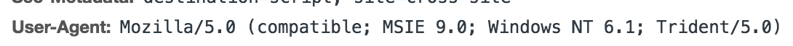
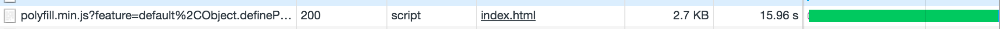

Next Polyfill
===================

Next Polyfill 提供了一个体积更小,更灵活的 web 端 polyfill 方案

## 安装
```sh
npm i --save-dev next-polyfill
```

## 使用

Next Polyfill 做的事情很简单，读取你的代码并解析出你使用的 js 语言特性，生成对应 ployfill.io 对应的 url(你也可以替换成自己实现的版本)

其中 parser 的用法如下:

```javascript
import {parse} from 'next-polyfill';

const code = `
    Object.entries({a: 1})
`;

parse(code, {}, (err, result)=>{
    if(err) throw err;

    console.log(result) 
    // Set {
    //    'es7.object.entries',
    //    'es6.array.iterator',
    //    'web.dom.iterable' 
    //}

});

```
可以在回调的参数 result 内取到当前代码所使用的 JavaScript 语法特性

### 在 Webpack 中使用

定义 webpack.config.js

```js
let NextPolyfillWebpackPlugin = require('next-polyfill').NextPolyfillWebpackPlugin
module.exports = {
    plugins: [
        // ...
        new NextPolyfillWebpackPlugin()
        // ...
    ]
}
```

接着定义我们的 entry

```js
console.log('aloha');

[].includes(1);
```


`NextPolyfillWebpackPlugin` 会自动在输出的 html 模板处添加 script 标签,输出如下
```html
<script src="https://polyfill.io/v3/polyfill.min.js?feature=default%2CObject.defineProperty%2CSymbol%2CSymbol%2CObject.create%2CFunction.prototype.bind%2CString.prototype.includes%2CArray.prototype.includes&amp;unknown=polyfill&amp;flags=gated"></script>
```

可以看到在 chrome 72 下 polyfill 体积仅为 496b，几乎只包含请求头的大小


可以看到在 chrome 72 下 polyfill 体积仅为 496b，几乎只包含请求头的大小

接着让我们把 UA 设置成 IE9





可以看到在只有一行代码的情况下 polyfill 的体积依然达到了2.7 k

优化的效果相当明显，而且这一切只需要你增加一个 webpack plugin，剩下的 Next polyfill 会帮你处理

详细的代码[请看](https://github.com/ZhechenLi/next-polyfill/tree/feature/doc/test/webapck) 

## License
MIT


